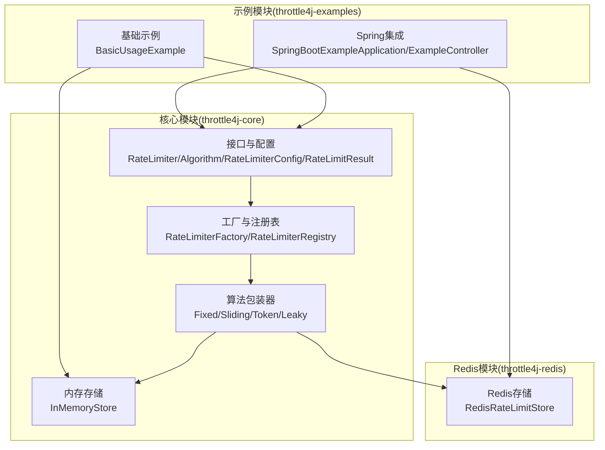
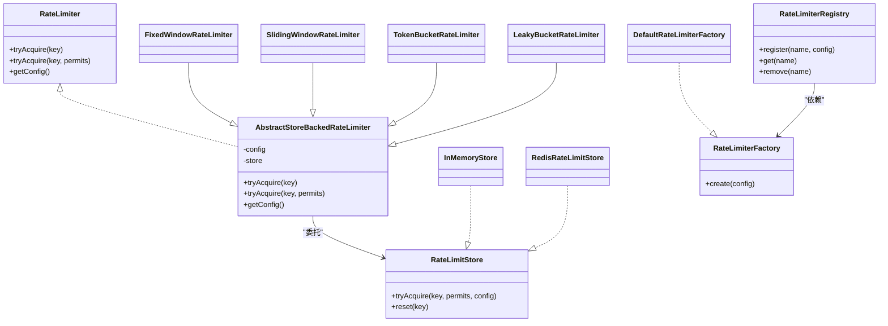
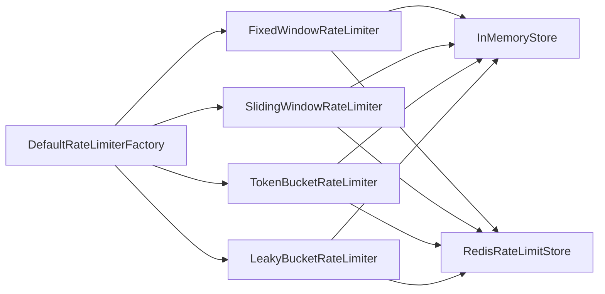
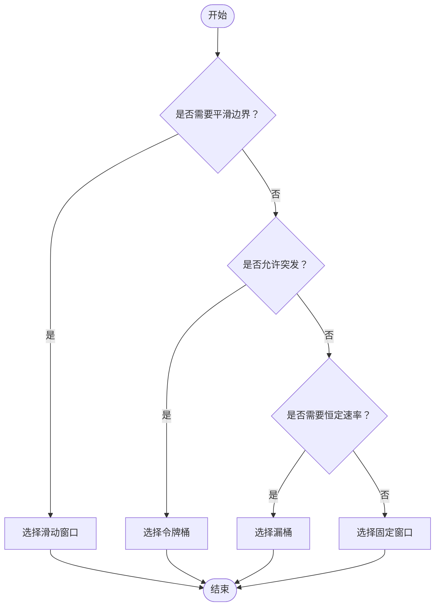

# 限流算法实现

<cite>
**本文引用的文件**
- [RateLimiter.java](file://throttle4j-core/src/main/java/com/throttle4j/core/RateLimiter.java)
- [Algorithm.java](file://throttle4j-core/src/main/java/com/throttle4j/core/Algorithm.java)
- [RateLimiterConfig.java](file://throttle4j-core/src/main/java/com/throttle4j/core/RateLimiterConfig.java)
- [RateLimitResult.java](file://throttle4j-core/src/main/java/com/throttle4j/core/RateLimitResult.java)
- [RateLimiterFactory.java](file://throttle4j-core/src/main/java/com/throttle4j/core/RateLimiterFactory.java)
- [RateLimiterRegistry.java](file://throttle4j-core/src/main/java/com/throttle4j/core/RateLimiterRegistry.java)
- [AbstractStoreBackedRateLimiter.java](file://throttle4j-core/src/main/java/com/throttle4j/algorithm/AbstractStoreBackedRateLimiter.java)
- [FixedWindowRateLimiter.java](file://throttle4j-core/src/main/java/com/throttle4j/algorithm/FixedWindowRateLimiter.java)
- [SlidingWindowRateLimiter.java](file://throttle4j-core/src/main/java/com/throttle4j/algorithm/SlidingWindowRateLimiter.java)
- [TokenBucketRateLimiter.java](file://throttle4j-core/src/main/java/com/throttle4j/algorithm/TokenBucketRateLimiter.java)
- [LeakyBucketRateLimiter.java](file://throttle4j-core/src/main/java/com/throttle4j/algorithm/LeakyBucketRateLimiter.java)
- [DefaultRateLimiterFactory.java](file://throttle4j-core/src/main/java/com/throttle4j/algorithm/DefaultRateLimiterFactory.java)
- [RateLimitStore.java](file://throttle4j-core/src/main/java/com/throttle4j/store/RateLimitStore.java)
- [InMemoryStore.java](file://throttle4j-core/src/main/java/com/throttle4j/store/InMemoryStore.java)
- [RedisRateLimitStore.java](file://throttle4j-redis/src/main/java/com/throttle4j/redis/RedisRateLimitStore.java)
- [RedisRateLimitStoreBuilder.java](file://throttle4j-redis/src/main/java/com/throttle4j/redis/RedisRateLimitStoreBuilder.java)
- [BasicUsageExample.java](file://throttle4j-examples/src/main/java/com/throttle4j/example/BasicUsageExample.java)
- [SpringBootExampleApplication.java](file://throttle4j-examples/src/main/java/com/throttle4j/example/SpringBootExampleApplication.java)
- [ExampleController.java](file://throttle4j-examples/src/main/java/com/throttle4j/example/ExampleController.java)
- [ExampleExceptionHandler.java](file://throttle4j-examples/src/main/java/com/throttle4j/example/ExampleExceptionHandler.java)
- [application.yml](file://throttle4j-examples/src/main/resources/application.yml)
- [README.md](file://README.md)
- [README_CN.md](file://README_CN.md)
</cite>

## 目录
1. [引言](#引言)
2. [项目结构](#项目结构)
3. [核心组件](#核心组件)
4. [架构总览](#架构总览)
5. [详细组件分析](#详细组件分析)
6. [依赖分析](#依赖分析)
7. [性能考量](#性能考量)
8. [故障排查指南](#故障排查指南)
9. [结论](#结论)
10. [附录](#附录)

## 引言
本文件系统性梳理 throttle4j 的四种限流算法：固定窗口计数器（Fixed Window）、滑动窗口计数器（Sliding Window）、令牌桶（Token Bucket）与漏桶（Leaky Bucket）。围绕数学模型、实现细节、适用场景、性能指标（精度、吞吐量、内存占用）、边界情况与优化建议展开，并提供算法选择决策树与实际使用示例路径，帮助开发者基于业务需求做出最优选择。

## 项目结构
throttle4j 采用分层清晰的模块化设计：
- 核心层（throttle4j-core）：定义算法接口、配置、结果、工厂与注册表，以及内存态的存储实现。
- Redis 分布式层（throttle4j-redis）：基于 Lua 脚本在 Redis 上原子执行算法逻辑。
- 示例层（throttle4j-examples）：提供基础用法与 Spring Boot 集成示例。

**图表来源**
- [RateLimiter.java:8-31](file://throttle4j-core/src/main/java/com/throttle4j/core/RateLimiter.java#L8-L31)
- [Algorithm.java:6-15](file://throttle4j-core/src/main/java/com/throttle4j/core/Algorithm.java#L6-L15)
- [RateLimiterConfig.java:8-50](file://throttle4j-core/src/main/java/com/throttle4j/core/RateLimiterConfig.java#L8-L50)
- [DefaultRateLimiterFactory.java:14-38](file://throttle4j-core/src/main/java/com/throttle4j/algorithm/DefaultRateLimiterFactory.java#L14-L38)
- [AbstractStoreBackedRateLimiter.java:14-41](file://throttle4j-core/src/main/java/com/throttle4j/algorithm/AbstractStoreBackedRateLimiter.java#L14-L41)
- [InMemoryStore.java:24-101](file://throttle4j-core/src/main/java/com/throttle4j/store/InMemoryStore.java#L24-L101)
- [RedisRateLimitStore.java:40-118](file://throttle4j-redis/src/main/java/com/throttle4j/redis/RedisRateLimitStore.java#L40-L118)
- [BasicUsageExample.java](file://throttle4j-examples/src/main/java/com/throttle4j/example/BasicUsageExample.java)
- [SpringBootExampleApplication.java](file://throttle4j-examples/src/main/java/com/throttle4j/example/SpringBootExampleApplication.java)

**章节来源**
- [README.md](file://README.md)
- [README_CN.md](file://README_CN.md)

## 核心组件
- 接口与契约
  - RateLimiter：统一的 tryAcquire(key[, permits]) 与 getConfig()。
  - RateLimitResult：封装允许/拒绝、剩余配额、重置时间、建议重试时延。
  - Algorithm：枚举四种算法类型。
  - RateLimiterConfig：不可变配置，构建器校验参数合法性。
- 工厂与注册表
  - RateLimiterFactory：按配置创建具体限流器实例。
  - RateLimiterRegistry：命名化的线程安全注册中心。
- 存储抽象
  - RateLimitStore：定义 tryAcquire 与 reset。
  - InMemoryStore：单机内存态实现，含空闲清理。
  - RedisRateLimitStore：基于 Lua 原子脚本的分布式实现。

**章节来源**
- [RateLimiter.java:8-31](file://throttle4j-core/src/main/java/com/throttle4j/core/RateLimiter.java#L8-L31)
- [RateLimitResult.java:6-67](file://throttle4j-core/src/main/java/com/throttle4j/core/RateLimitResult.java#L6-L67)
- [Algorithm.java:6-15](file://throttle4j-core/src/main/java/com/throttle4j/core/Algorithm.java#L6-L15)
- [RateLimiterConfig.java:8-112](file://throttle4j-core/src/main/java/com/throttle4j/core/RateLimiterConfig.java#L8-L112)
- [RateLimiterFactory.java:6-15](file://throttle4j-core/src/main/java/com/throttle4j/core/RateLimiterFactory.java#L6-L15)
- [RateLimiterRegistry.java:14-60](file://throttle4j-core/src/main/java/com/throttle4j/core/RateLimiterRegistry.java#L14-L60)
- [RateLimitStore.java:15-34](file://throttle4j-core/src/main/java/com/throttle4j/store/RateLimitStore.java#L15-L34)
- [InMemoryStore.java:24-101](file://throttle4j-core/src/main/java/com/throttle4j/store/InMemoryStore.java#L24-L101)
- [RedisRateLimitStore.java:40-118](file://throttle4j-redis/src/main/java/com/throttle4j/redis/RedisRateLimitStore.java#L40-L118)

## 架构总览
throttle4j 将“算法逻辑”下沉到“存储实现”，限流器仅负责参数校验与委托调用，从而实现：
- 算法与存储解耦：同一算法可运行于内存或 Redis。
- 线程安全：核心状态均通过同步块或并发容器保护。
- 可扩展：新增算法只需实现 RateLimitStore 或扩展工厂。

**图表来源**
- [AbstractStoreBackedRateLimiter.java:14-41](file://throttle4j-core/src/main/java/com/throttle4j/algorithm/AbstractStoreBackedRateLimiter.java#L14-L41)
- [InMemoryStore.java:24-101](file://throttle4j-core/src/main/java/com/throttle4j/store/InMemoryStore.java#L24-L101)
- [RedisRateLimitStore.java:40-118](file://throttle4j-redis/src/main/java/com/throttle4j/redis/RedisRateLimitStore.java#L40-L118)
- [DefaultRateLimiterFactory.java:14-38](file://throttle4j-core/src/main/java/com/throttle4j/algorithm/DefaultRateLimiterFactory.java#L14-L38)
- [RateLimiterRegistry.java:14-60](file://throttle4j-core/src/main/java/com/throttle4j/core/RateLimiterRegistry.java#L14-L60)

## 详细组件分析

### 固定窗口计数器（Fixed Window）
- 数学模型
  - 时间轴被划分为长度为 windowMillis 的连续窗口；每个窗口内请求数累计，超过 limit 即拒绝。
  - 在窗口边界处存在“突发”风险：窗口末尾可能瞬时超过 limit，随后被重置。
- 实现要点
  - 使用 synchronized 保护每个 key 的状态，确保原子性。
  - 窗口起始时间与计数器随窗口滚动重置。
  - 拒绝时返回剩余配额与重置时间点。
- 复杂度
  - 单次请求 O(1)，空间复杂度 O(k)（k 为活跃 key 数）。
- 适用场景
  - 对边界瞬时峰值不敏感、追求简单与低开销的场景。
- 边界与陷阱
  - 窗口边界抖动导致的“双倍”效应：相邻窗口交界处可能允许近似 2×limit 的请求。
- 性能与优化
  - 内存占用极低；CPU 开销小；可通过更短窗口提升平滑度但增加写竞争。
- 关键实现路径
  - [acquireFixedWindow(...):150-170](file://throttle4j-core/src/main/java/com/throttle4j/store/InMemoryStore.java#L150-L170)

**章节来源**
- [FixedWindowRateLimiter.java:12-17](file://throttle4j-core/src/main/java/com/throttle4j/algorithm/FixedWindowRateLimiter.java#L12-L17)
- [InMemoryStore.java:150-170](file://throttle4j-core/src/main/java/com/throttle4j/store/InMemoryStore.java#L150-L170)

### 滑动窗口计数器（Sliding Window）
- 数学模型
  - 将窗口细分为固定数量的子槽（默认 10），通过“近似滑动”逼近真实滑动窗口效果。
  - 每个子槽记录该时间段内的请求数，超出 limit 则拒绝。
- 实现要点
  - 计算当前槽 ID，剔除过期槽位，累加有效槽位计数。
  - 拒绝时计算最旧槽位到期后的重试间隔。
- 复杂度
  - 单次请求 O(s)，s 为子槽数（默认 10）；空间 O(s)。
- 适用场景
  - 需要避免窗口边界“双倍”问题，且对平滑度有要求的场景。
- 边界与陷阱
  - 子槽粒度越细越接近真实滑动窗口，但会增加常数开销。
- 性能与优化
  - 默认 10 槽已能在大多数场景下提供良好平滑度；可根据 QPS 调整。
- 关键实现路径
  - [acquireSlidingWindow(...):172-212](file://throttle4j-core/src/main/java/com/throttle4j/store/InMemoryStore.java#L172-L212)

**章节来源**
- [SlidingWindowRateLimiter.java:10-15](file://throttle4j-core/src/main/java/com/throttle4j/algorithm/SlidingWindowRateLimiter.java#L10-L15)
- [InMemoryStore.java:172-212](file://throttle4j-core/src/main/java/com/throttle4j/store/InMemoryStore.java#L172-L212)

### 令牌桶（Token Bucket）
- 数学模型
  - 初始桶容量为 limit；以 refillRate（单位时间内）向桶中补充令牌；每次请求消耗 permits 令牌。
  - 若桶中不足则延迟至可满足为止，重试间隔与缺额成正比。
- 实现要点
  - 采用“惰性补给”：在每次 tryAcquire 时按 elapsedSec × refillRate 计算补给量。
  - 返回允许时的剩余令牌数与重置时间；拒绝时返回建议重试时延。
- 复杂度
  - 单次请求 O(1)；空间 O(k)。
- 适用场景
  - 平滑突发、保障长期速率稳定；适合长尾请求与突发流量。
- 边界与陷阱
  - 高频短请求下，频繁计算补给可能带来微小 CPU 开销。
- 性能与优化
  - 合理设置 limit 与 refillRate；大 QPS 下建议使用 Redis 版本以降低锁竞争。
- 关键实现路径
  - [acquireTokenBucket(...):214-236](file://throttle4j-core/src/main/java/com/throttle4j/store/InMemoryStore.java#L214-L236)

**章节来源**
- [TokenBucketRateLimiter.java:10-15](file://throttle4j-core/src/main/java/com/throttle4j/algorithm/TokenBucketRateLimiter.java#L10-L15)
- [InMemoryStore.java:214-236](file://throttle4j-core/src/main/java/com/throttle4j/store/InMemoryStore.java#L214-L236)

### 漏桶（Leaky Bucket）
- 数学模型
  - 桶容量为 limit；以恒定速率（limit/windowMillis）漏水；请求到达即消耗桶中“水位”。
  - 超限时根据溢出量计算重试间隔。
- 实现要点
  - 每次访问按 elapsed × leakRate 衰减水位，再判断是否可容纳新请求。
  - 允许时返回剩余容量与下次可释放的等待时间。
- 复杂度
  - 单次请求 O(1)；空间 O(k)。
- 适用场景
  - 强制恒定输出速率，抑制突发；适合对外服务限速与削峰。
- 边界与陷阱
  - 与令牌桶相比，漏桶对突发更严格，但灵活性较低。
- 性能与优化
  - 与令牌桶类似，建议高并发场景使用 Redis 版本。
- 关键实现路径
  - [acquireLeakyBucket(...):238-263](file://throttle4j-core/src/main/java/com/throttle4j/store/InMemoryStore.java#L238-L263)

**章节来源**
- [LeakyBucketRateLimiter.java:10-15](file://throttle4j-core/src/main/java/com/throttle4j/algorithm/LeakyBucketRateLimiter.java#L10-L15)
- [InMemoryStore.java:238-263](file://throttle4j-core/src/main/java/com/throttle4j/store/InMemoryStore.java#L238-L263)

### 分布式实现（Redis）
- 设计思想
  - 将算法逻辑下沉到 Lua 脚本，在 Redis 侧原子执行，避免竞态与网络往返。
  - 支持固定窗口、滑动窗口（基于有序集合）与令牌桶（复用）。
- 关键流程
  - 根据算法分派到对应脚本，传入 capacity/refillRate/permits/now 等参数，解析 MULTI 返回值生成 RateLimitResult。
- 性能与可靠性
  - 单请求单脚本，原子性强；适合跨节点一致性与高并发场景。
- 关键实现路径
  - [RedisRateLimitStore.tryAcquire(...):80-110](file://throttle4j-redis/src/main/java/com/throttle4j/redis/RedisRateLimitStore.java#L80-L110)
  - [RedisRateLimitStore.runTokenBucket(...):165-191](file://throttle4j-redis/src/main/java/com/throttle4j/redis/RedisRateLimitStore.java#L165-L191)

**章节来源**
- [RedisRateLimitStore.java:40-118](file://throttle4j-redis/src/main/java/com/throttle4j/redis/RedisRateLimitStore.java#L40-L118)
- [RedisRateLimitStoreBuilder.java:20-60](file://throttle4j-redis/src/main/java/com/throttle4j/redis/RedisRateLimitStoreBuilder.java#L20-L60)

## 依赖分析
- 组件耦合
  - 算法包装器与存储实现通过接口解耦；工厂与注册表进一步解耦使用者与具体实现。
  - Redis 实现依赖 Lua 脚本资源，需保证加载成功。
- 外部依赖
  - Redis 模块依赖 Lettuce 客户端；内存实现依赖并发容器与调度器。
- 循环依赖
  - 未发现循环依赖；层次清晰。

**图表来源**
- [DefaultRateLimiterFactory.java:22-37](file://throttle4j-core/src/main/java/com/throttle4j/algorithm/DefaultRateLimiterFactory.java#L22-L37)
- [InMemoryStore.java:68-93](file://throttle4j-core/src/main/java/com/throttle4j/store/InMemoryStore.java#L68-L93)
- [RedisRateLimitStore.java:80-110](file://throttle4j-redis/src/main/java/com/throttle4j/redis/RedisRateLimitStore.java#L80-L110)

**章节来源**
- [DefaultRateLimiterFactory.java:14-38](file://throttle4j-core/src/main/java/com/throttle4j/algorithm/DefaultRateLimiterFactory.java#L14-L38)
- [RateLimiterRegistry.java:14-60](file://throttle4j-core/src/main/java/com/throttle4j/core/RateLimiterRegistry.java#L14-L60)

## 性能考量
- 精度
  - 滑动窗口 > 令牌桶 ≈ 漏桶 > 固定窗口（窗口边界抖动）。
- 吞吐量
  - 固定窗口与滑动窗口在单机上通常具备最高吞吐；令牌桶与漏桶受“恒定速率”约束，适合稳态。
- 内存占用
  - 固定窗口与滑动窗口：O(k)；滑动窗口额外 O(s)（子槽数组）。
  - 令牌桶与漏桶：O(k)；Redis 版本由键数量决定。
- 并发与锁
  - 内存实现对每个 key 加锁，高并发下锁竞争可能成为瓶颈；Redis 版本天然原子，避免锁竞争。
- 时钟与漂移
  - 令牌桶与漏桶依赖时间差计算补给/衰减，建议使用单调时钟；Redis 版本以服务器时间为基准，避免客户端漂移。

[本节为通用性能讨论，无需特定文件引用]

## 故障排查指南
- 常见错误与定位
  - 参数非法：limit 必须 > 0；令牌桶 refillRate 必须 > 0；windowMillis 对非令牌桶也必须 > 0。
  - Redis 脚本缺失：构建时未找到 Lua 脚本资源，需检查 classpath。
  - 资源关闭：InMemoryStore 支持关闭与清理，避免泄漏。
- 结果解读
  - RateLimitResult 中的 remaining、resetAt、retryAfterMillis 可用于客户端退避与提示。
- 建议
  - 生产环境优先使用 Redis 版本；结合监控观察 key 数量与清理频率。

**章节来源**
- [RateLimiterConfig.java:91-110](file://throttle4j-core/src/main/java/com/throttle4j/core/RateLimiterConfig.java#L91-L110)
- [RedisRateLimitStore.java:226-251](file://throttle4j-redis/src/main/java/com/throttle4j/redis/RedisRateLimitStore.java#L226-L251)
- [InMemoryStore.java:142-146](file://throttle4j-core/src/main/java/com/throttle4j/store/InMemoryStore.java#L142-L146)

## 结论
- 四种算法各有侧重：固定窗口最简、滑动窗口更平滑、令牌桶兼顾突发与稳态、漏桶强制恒定速率。
- 单机场景可选内存实现；跨节点与高并发建议 Redis 实现。
- 选择建议：若追求极致吞吐与简单，选固定窗口；若需要平滑边界，选滑动窗口；若需要削峰填谷与长期稳定，选令牌桶或漏桶。

[本节为总结，无需特定文件引用]

## 附录

### 算法选择决策树

[此图为概念性决策树，无需图表来源]

### 使用示例与集成
- 基础用法
  - 创建配置、工厂与限流器，调用 tryAcquire 获取 RateLimitResult。
  - 参考：[BasicUsageExample.java](file://throttle4j-examples/src/main/java/com/throttle4j/example/BasicUsageExample.java)
- Spring Boot 集成
  - 注解与拦截器自动装配，简化接入。
  - 参考：
    - [SpringBootExampleApplication.java](file://throttle4j-examples/src/main/java/com/throttle4j/example/SpringBootExampleApplication.java)
    - [ExampleController.java](file://throttle4j-examples/src/main/java/com/throttle4j/example/ExampleController.java)
    - [ExampleExceptionHandler.java](file://throttle4j-examples/src/main/java/com/throttle4j/example/ExampleExceptionHandler.java)
    - [application.yml](file://throttle4j-examples/src/main/resources/application.yml)

**章节来源**
- [BasicUsageExample.java](file://throttle4j-examples/src/main/java/com/throttle4j/example/BasicUsageExample.java)
- [SpringBootExampleApplication.java](file://throttle4j-examples/src/main/java/com/throttle4j/example/SpringBootExampleApplication.java)
- [ExampleController.java](file://throttle4j-examples/src/main/java/com/throttle4j/example/ExampleController.java)
- [ExampleExceptionHandler.java](file://throttle4j-examples/src/main/java/com/throttle4j/example/ExampleExceptionHandler.java)
- [application.yml](file://throttle4j-examples/src/main/resources/application.yml)

### 关键实现要点清单
- 配置校验：在构建器阶段集中校验参数合法性，避免运行时异常。
  - [RateLimiterConfig.Builder.build(...):91-110](file://throttle4j-core/src/main/java/com/throttle4j/core/RateLimiterConfig.java#L91-L110)
- 委托模式：算法包装器只做参数校验与转发，核心逻辑在存储实现。
  - [AbstractStoreBackedRateLimiter.tryAcquire(...):29-35](file://throttle4j-core/src/main/java/com/throttle4j/algorithm/AbstractStoreBackedRateLimiter.java#L29-L35)
- 原子性保障：内存实现对每个 key 加锁；Redis 实现通过 Lua 脚本原子执行。
  - [InMemoryStore.acquire*(...):150-263](file://throttle4j-core/src/main/java/com/throttle4j/store/InMemoryStore.java#L150-L263)
  - [RedisRateLimitStore.tryAcquire(...):80-110](file://throttle4j-redis/src/main/java/com/throttle4j/redis/RedisRateLimitStore.java#L80-L110)
- 结果建模：统一的 RateLimitResult 提供丰富的上下文信息，便于客户端处理。
  - [RateLimitResult:6-67](file://throttle4j-core/src/main/java/com/throttle4j/core/RateLimitResult.java#L6-L67)

**章节来源**
- [RateLimiterConfig.java:91-110](file://throttle4j-core/src/main/java/com/throttle4j/core/RateLimiterConfig.java#L91-L110)
- [AbstractStoreBackedRateLimiter.java:29-35](file://throttle4j-core/src/main/java/com/throttle4j/algorithm/AbstractStoreBackedRateLimiter.java#L29-L35)
- [InMemoryStore.java:150-263](file://throttle4j-core/src/main/java/com/throttle4j/store/InMemoryStore.java#L150-L263)
- [RedisRateLimitStore.java:80-110](file://throttle4j-redis/src/main/java/com/throttle4j/redis/RedisRateLimitStore.java#L80-L110)
- [RateLimitResult.java:6-67](file://throttle4j-core/src/main/java/com/throttle4j/core/RateLimitResult.java#L6-L67)