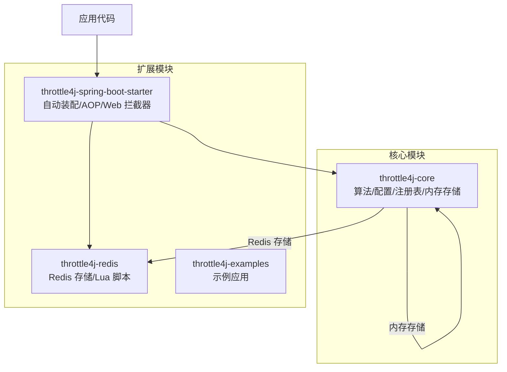
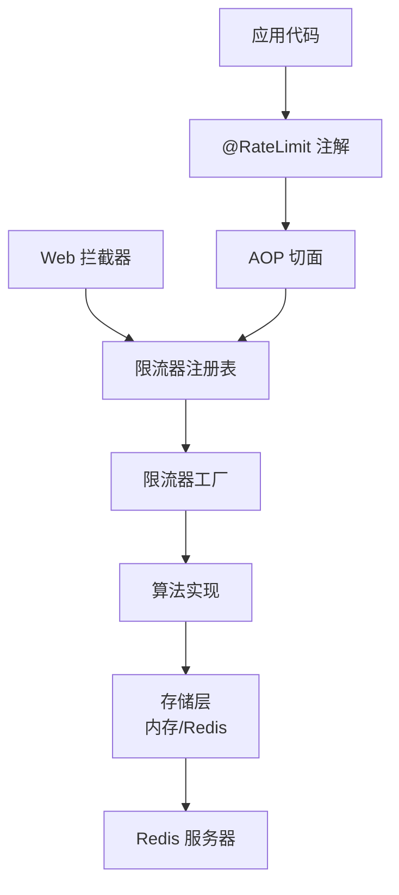
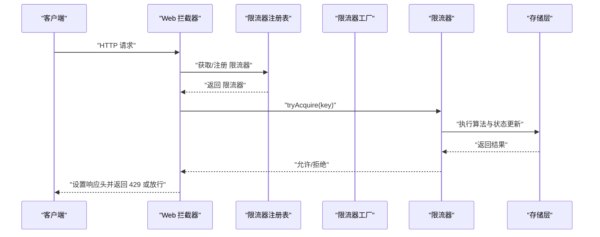
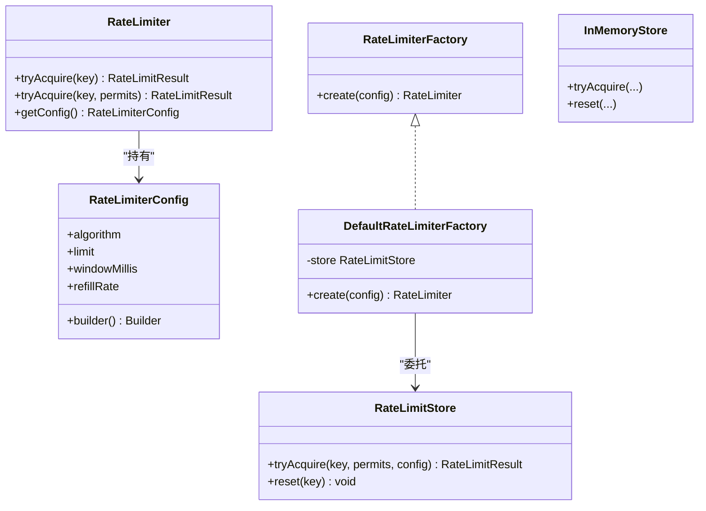
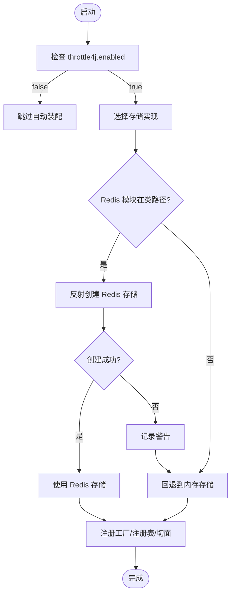
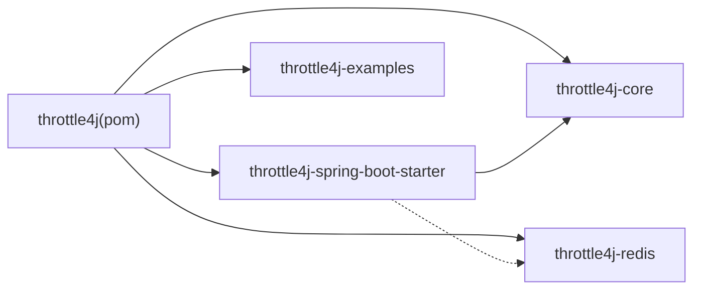

# 项目概述

<cite>
**本文引用的文件**
- [README.md](file://README.md)
- [README_CN.md](file://README_CN.md)
- [pom.xml](file://pom.xml)
- [ROADMAP.md](file://ROADMAP.md)
- [CONTRIBUTING.md](file://CONTRIBUTING.md)
- [RateLimiter.java](file://throttle4j-core/src/main/java/com/throttle4j/core/RateLimiter.java)
- [RateLimiterConfig.java](file://throttle4j-core/src/main/java/com/throttle4j/core/RateLimiterConfig.java)
- [RateLimiterFactory.java](file://throttle4j-core/src/main/java/com/throttle4j/core/RateLimiterFactory.java)
- [DefaultRateLimiterFactory.java](file://throttle4j-core/src/main/java/com/throttle4j/algorithm/DefaultRateLimiterFactory.java)
- [RateLimitStore.java](file://throttle4j-core/src/main/java/com/throttle4j/store/RateLimitStore.java)
- [InMemoryStore.java](file://throttle4j-core/src/main/java/com/throttle4j/store/InMemoryStore.java)
- [RateLimit.java](file://throttle4j-spring-boot-starter/src/main/java/com/throttle4j/spring/annotation/RateLimit.java)
- [Throttle4jAutoConfiguration.java](file://throttle4j-spring-boot-starter/src/main/java/com/throttle4j/spring/autoconfigure/Throttle4jAutoConfiguration.java)
- [RateLimitAspect.java](file://throttle4j-spring-boot-starter/src/main/java/com/throttle4j/spring/aop/RateLimitAspect.java)
- [RateLimitInterceptor.java](file://throttle4j-spring-boot-starter/src/main/java/com/throttle4j/spring/web/RateLimitInterceptor.java)
- [SpringBootExampleApplication.java](file://throttle4j-examples/src/main/java/com/throttle4j/example/SpringBootExampleApplication.java)
</cite>

## 目录
1. [引言](#引言)
2. [项目结构](#项目结构)
3. [核心组件](#核心组件)
4. [架构总览](#架构总览)
5. [详细组件分析](#详细组件分析)
6. [依赖分析](#依赖分析)
7. [性能考量](#性能考量)
8. [故障排查指南](#故障排查指南)
9. [结论](#结论)
10. [附录](#附录)

## 引言
throttle4j 是一个面向 Java 生态的轻量、高性能分布式限流库，旨在为 API 网关、微服务与数据库等关键系统提供一致、可插拔且易用的流量控制能力。其核心价值主张包括：
- 四种成熟限流算法开箱即用，覆盖固定窗口、滑动窗口、令牌桶与漏桶，满足不同精度与吞吐需求。
- 可插拔存储层：单机使用内存存储，分布式场景使用 Redis 存储，并支持故障降级。
- Spring Boot 零配置集成：通过自动装配与 AOP/拦截器实现声明式限流。
- 声明式 API：通过 @RateLimit 注解透明地保护方法或全局路径。

在 Java 生态中，throttle4j 将“算法抽象 + 存储抽象 + Spring 集成”三者解耦，既可作为纯 Java 库独立使用，也可通过 Spring Boot Starter 快速落地到 Web 应用中。

## 项目结构
项目采用多模块聚合结构，围绕“核心算法与 API”“分布式存储”“Spring Boot 集成”“示例应用”四个维度组织：
- throttle4j-core：定义限流算法接口、配置模型、工厂与注册表，以及内存存储。
- throttle4j-redis：基于 Lettuce 的 Redis 存储与原子 Lua 脚本，提供分布式能力。
- throttle4j-spring-boot-starter：自动装配、AOP 切面、Web 拦截器与响应头处理。
- throttle4j-examples：演示如何在 Spring Boot 中编程式与声明式使用。

图表来源
- [pom.xml:15-20](file://pom.xml#L15-L20)
- [README.md:76-94](file://README.md#L76-L94)

章节来源
- [pom.xml:15-20](file://pom.xml#L15-L20)
- [README.md:134-142](file://README.md#L134-L142)

## 核心组件
- RateLimiter 接口：定义 tryAcquire(key) 与 tryAcquire(key, permits) 等核心方法，保证线程安全。
- RateLimiterConfig：不可变配置，支持算法、限流阈值、窗口时长、令牌桶补充速率等。
- RateLimiterFactory：根据配置创建具体算法的限流器实例。
- DefaultRateLimiterFactory：按配置算法类型创建对应限流器包装器。
- RateLimitStore 接口：抽象限流状态存储，统一由限流器委托执行。
- InMemoryStore：单机内存存储实现，适合本地开发与单节点部署。
- Spring Boot 集成：@RateLimit 注解、AOP 切面、Web 拦截器、自动装配与配置属性。

章节来源
- [RateLimiter.java:8-31](file://throttle4j-core/src/main/java/com/throttle4j/core/RateLimiter.java#L8-L31)
- [RateLimiterConfig.java:8-112](file://throttle4j-core/src/main/java/com/throttle4j/core/RateLimiterConfig.java#L8-L112)
- [RateLimiterFactory.java:6-15](file://throttle4j-core/src/main/java/com/throttle4j/core/RateLimiterFactory.java#L6-L15)
- [DefaultRateLimiterFactory.java:14-38](file://throttle4j-core/src/main/java/com/throttle4j/algorithm/DefaultRateLimiterFactory.java#L14-L38)
- [RateLimitStore.java:15-34](file://throttle4j-core/src/main/java/com/throttle4j/store/RateLimitStore.java#L15-L34)
- [InMemoryStore.java](file://throttle4j-core/src/main/java/com/throttle4j/store/InMemoryStore.java)

## 架构总览
throttle4j 的架构强调“算法与存储分离、Spring 集成可选”。核心交互链路如下：
- 应用代码通过 @RateLimit 或编程式调用触发限流。
- AOP 切面解析注解、构建配置、从注册表获取/创建限流器并尝试获取许可。
- 限流器委托存储层执行算法逻辑（内存或 Redis）。
- Web 拦截器对请求路径进行全局限流并设置标准响应头。
- 当启用 Redis 且类路径存在时，自动装配创建 Redis 存储；否则回退到内存存储。

图表来源
- [README.md:76-94](file://README.md#L76-L94)
- [RateLimitAspect.java:68-91](file://throttle4j-spring-boot-starter/src/main/java/com/throttle4j/spring/aop/RateLimitAspect.java#L68-L91)
- [RateLimitInterceptor.java:55-79](file://throttle4j-spring-boot-starter/src/main/java/com/throttle4j/spring/web/RateLimitInterceptor.java#L55-L79)
- [Throttle4jAutoConfiguration.java:45-57](file://throttle4j-spring-boot-starter/src/main/java/com/throttle4j/spring/autoconfigure/Throttle4jAutoConfiguration.java#L45-L57)

## 详细组件分析

### 组件一：声明式 API 与自动装配
- @RateLimit 注解：支持 SpEL 表达式的键生成、窗口时长、算法与配额，以及失败时的回退方法。
- AOP 切面：拦截标注方法，动态构建配置，从注册表获取限流器，执行许可申请，命中则放行，否则执行回退或抛出异常。
- Web 拦截器：基于请求方法+URI 构建键，全局生效，设置标准限流响应头并在超限时返回 429。
- 自动装配：根据配置选择存储实现（Redis 或内存），并注册工厂与注册表。

图表来源
- [RateLimitInterceptor.java:55-79](file://throttle4j-spring-boot-starter/src/main/java/com/throttle4j/spring/web/RateLimitInterceptor.java#L55-L79)
- [RateLimitAspect.java:68-91](file://throttle4j-spring-boot-starter/src/main/java/com/throttle4j/spring/aop/RateLimitAspect.java#L68-L91)

章节来源
- [RateLimit.java:26-74](file://throttle4j-spring-boot-starter/src/main/java/com/throttle4j/spring/annotation/RateLimit.java#L26-L74)
- [RateLimitAspect.java:40-185](file://throttle4j-spring-boot-starter/src/main/java/com/throttle4j/spring/aop/RateLimitAspect.java#L40-L185)
- [RateLimitInterceptor.java:26-125](file://throttle4j-spring-boot-starter/src/main/java/com/throttle4j/spring/web/RateLimitInterceptor.java#L26-L125)
- [Throttle4jAutoConfiguration.java:30-131](file://throttle4j-spring-boot-starter/src/main/java/com/throttle4j/spring/autoconfigure/Throttle4jAutoConfiguration.java#L30-L131)

### 组件二：算法与存储抽象
- 算法抽象：通过 RateLimiterConfig 指定算法类型，DefaultRateLimiterFactory 根据算法创建对应限流器。
- 存储抽象：RateLimitStore 定义 tryAcquire 与 reset，InMemoryStore 提供单机实现，throttle4j-redis 提供分布式实现。
- 工厂与注册表：统一创建与复用限流器实例，降低对象创建成本。

图表来源
- [RateLimiter.java:8-31](file://throttle4j-core/src/main/java/com/throttle4j/core/RateLimiter.java#L8-L31)
- [RateLimiterConfig.java:8-112](file://throttle4j-core/src/main/java/com/throttle4j/core/RateLimiterConfig.java#L8-L112)
- [RateLimiterFactory.java:6-15](file://throttle4j-core/src/main/java/com/throttle4j/core/RateLimiterFactory.java#L6-L15)
- [DefaultRateLimiterFactory.java:14-38](file://throttle4j-core/src/main/java/com/throttle4j/algorithm/DefaultRateLimiterFactory.java#L14-L38)
- [RateLimitStore.java:15-34](file://throttle4j-core/src/main/java/com/throttle4j/store/RateLimitStore.java#L15-L34)
- [InMemoryStore.java](file://throttle4j-core/src/main/java/com/throttle4j/store/InMemoryStore.java)

章节来源
- [DefaultRateLimiterFactory.java:14-38](file://throttle4j-core/src/main/java/com/throttle4j/algorithm/DefaultRateLimiterFactory.java#L14-L38)
- [RateLimitStore.java:15-34](file://throttle4j-core/src/main/java/com/throttle4j/store/RateLimitStore.java#L15-L34)

### 组件三：Spring Boot 集成与配置
- 自动装配：根据 throttle4j.enabled 控制开关，按 throttle4j.store 选择存储实现；若 Redis 类路径不存在则回退内存存储。
- 配置属性：支持默认算法、窗口、限流阈值、Redis 连接参数与错误时的降级策略。
- 示例应用：提供可运行的 Spring Boot 示例入口。

图表来源
- [Throttle4jAutoConfiguration.java:28-99](file://throttle4j-spring-boot-starter/src/main/java/com/throttle4j/spring/autoconfigure/Throttle4jAutoConfiguration.java#L28-L99)
- [README.md:114-132](file://README.md#L114-L132)

章节来源
- [Throttle4jAutoConfiguration.java:30-131](file://throttle4j-spring-boot-starter/src/main/java/com/throttle4j/spring/autoconfigure/Throttle4jAutoConfiguration.java#L30-L131)
- [README.md:114-132](file://README.md#L114-L132)
- [SpringBootExampleApplication.java:12-18](file://throttle4j-examples/src/main/java/com/throttle4j/example/SpringBootExampleApplication.java#L12-L18)

## 依赖分析
- 技术栈与版本管理：父 POM 使用 Spring Boot BOM 管理版本，统一 JUnit、Mockito、SLF4J、Logback、Lettuce、Jackson 等依赖。
- 模块间依赖：throttle4j-spring-boot-starter 对 throttle4j-core 有编译期依赖；throttle4j-redis 与核心模块解耦，通过反射在运行时按需装配。
- 外部依赖：Redis 客户端 Lettuce，Web 框架 Spring MVC，AOP 框架 AspectJ。

图表来源
- [pom.xml:15-20](file://pom.xml#L15-L20)

章节来源
- [pom.xml:44-111](file://pom.xml#L44-L111)

## 性能考量
- 算法选型：README 中提供了四类算法的对比维度（适用场景、精确度、吞吐、内存）。通常推荐：
  - API 网关：令牌桶（兼顾突发与平均速率）
  - 窗口内公平性优先：滑动窗口
  - 保护下游稳定输出：漏桶
  - 简化场景：固定窗口
- 并发与一致性：核心接口与存储层均要求线程安全；Redis 场景通过 Lua 脚本保证原子性。
- 降级策略：当 Redis 不可用时自动回退内存存储，确保主流程不受影响。
- 响应头与可观测性：标准限流响应头便于客户端与网关侧处理；未来路线图计划引入 Micrometer 指标集成。

章节来源
- [README.md:103-112](file://README.md#L103-L112)
- [README.md:20-22](file://README.md#L20-L22)
- [ROADMAP.md:23-35](file://ROADMAP.md#L23-L35)

## 故障排查指南
- 问题：Redis 不可用导致限流失败
  - 现象：拦截器日志警告或异常，但请求仍可能放行。
  - 处理：确认 Redis 连接参数与网络连通性；检查 fallback-on-error 配置是否开启。
- 问题：@RateLimit 注解未生效
  - 现象：方法未被拦截或未抛出异常。
  - 处理：确认方法所在 Bean 已被 Spring 管理；检查注解参数（key、window、algorithm、permits）与 SpEL 是否正确；验证 fallbackMethod 是否存在且签名匹配。
- 问题：全局 Web 限流未生效
  - 现象：URL 未受控。
  - 处理：确认拦截器已注册；检查默认算法与窗口配置；核对请求方法与 URI 组合键。
- 问题：内存存储在多实例下不一致
  - 现象：分布式部署时限流状态不同步。
  - 处理：切换至 Redis 存储并正确配置连接参数。

章节来源
- [Throttle4jAutoConfiguration.java:45-57](file://throttle4j-spring-boot-starter/src/main/java/com/throttle4j/spring/autoconfigure/Throttle4jAutoConfiguration.java#L45-L57)
- [RateLimitAspect.java:68-91](file://throttle4j-spring-boot-starter/src/main/java/com/throttle4j/spring/aop/RateLimitAspect.java#L68-L91)
- [RateLimitInterceptor.java:55-79](file://throttle4j-spring-boot-starter/src/main/java/com/throttle4j/spring/web/RateLimitInterceptor.java#L55-L79)

## 结论
throttle4j 通过清晰的算法与存储抽象、灵活的 Spring Boot 集成以及稳健的故障降级策略，为 Java 生态提供了即插即用的限流解决方案。对于初学者，可从示例工程入手快速体验；对于资深开发者，可在核心模块中定制算法与存储，在 Spring 集成模块中扩展 AOP 与 Web 拦截器，以适配复杂生产环境。

## 附录
- 快速开始与配置参考见英文与中文 README。
- 贡献流程与代码规范见 CONTRIBUTING.md。
- 未来路线图涵盖 Redis 集群、指标监控、Spring Boot 3 支持与动态配置等方向。

章节来源
- [README.md:24-132](file://README.md#L24-L132)
- [README_CN.md:24-136](file://README_CN.md#L24-L136)
- [CONTRIBUTING.md:42-81](file://CONTRIBUTING.md#L42-L81)
- [ROADMAP.md:7-85](file://ROADMAP.md#L7-L85)