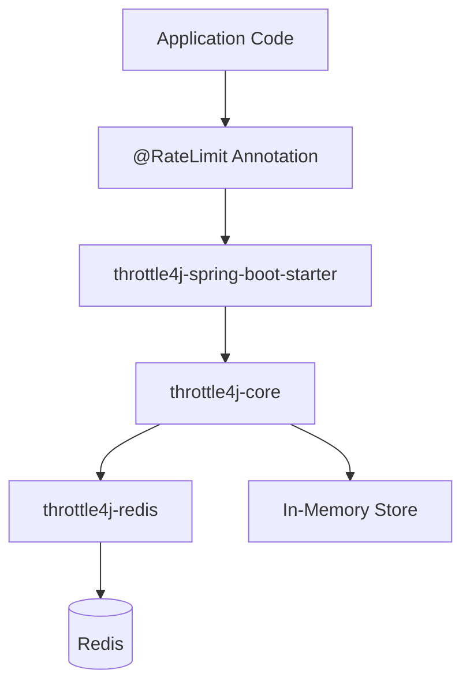

# throttle4j

[](https://github.com/USERNAME/throttle4j/actions)
[](https://github.com/USERNAME/throttle4j)
[](https://search.maven.org/artifact/com.throttle4j/throttle4j)
[](https://opensource.org/licenses/Apache-2.0)

A lightweight, high-performance distributed rate limiting library for Java.

[English](README.md) | [中文](README_CN.md)

---

## Features

- **Four Algorithms** — Fixed Window, Sliding Window, Token Bucket, Leaky Bucket out of the box.
- **Pluggable Stores** — In-memory store for single-node use; Redis store for distributed scenarios.
- **Spring Boot Starter** — Zero-config auto-configuration with sensible defaults.
- **Declarative API** — Annotate methods with `@RateLimit` to enforce limits transparently.
- **Thread-Safe & Lock-Free** — Atomic operations and Lua scripts ensure correctness under contention.
- **Graceful Degradation** — Automatic fallback to local store when Redis is unavailable.
- **Standard Response Headers** — `X-RateLimit-Limit`, `X-RateLimit-Remaining`, `X-RateLimit-Reset`, `Retry-After`.

## Quick Start

### Maven

```xml
<dependency>
    <groupId>com.throttle4j</groupId>
    <artifactId>throttle4j-spring-boot-starter</artifactId>
    <version>0.1.0</version>
</dependency>
```

### Gradle

```groovy
implementation 'com.throttle4j:throttle4j-spring-boot-starter:0.1.0'
```

### Programmatic Usage

```java
RateLimiterConfig config = RateLimiterConfig.builder()
        .algorithm(Algorithm.TOKEN_BUCKET)
        .limit(100)
        .window(Duration.ofMinutes(1))
        .build();

RateLimiter limiter = RateLimiter.of("api:user:42", config);

if (limiter.tryAcquire()) {
    // proceed
} else {
    // rejected — inspect limiter.getMetadata() for retry hints
}
```

### Declarative Usage (Spring Boot)

```java
@RestController
public class OrderController {

    @RateLimit(key = "#userId", limit = 10, window = 60, algorithm = Algorithm.SLIDING_WINDOW)
    @GetMapping("/orders/{userId}")
    public List<Order> list(@PathVariable Long userId) {
        return orderService.findByUser(userId);
    }
}
```

When the limit is exceeded the interceptor returns `HTTP 429 Too Many Requests` with the standard rate-limit headers populated.

## Architecture



| Layer | Responsibility |
| --- | --- |
| `throttle4j-core` | Algorithms, `RateLimiter` API, in-memory store, configuration model |
| `throttle4j-redis` | Distributed store backed by Lettuce + Lua scripts |
| `throttle4j-spring-boot-starter` | Auto-configuration, AOP interceptor, web filter |
| `throttle4j-examples` | Runnable samples for each algorithm and integration mode |

## Algorithms

| Algorithm | Best For | Accuracy | Throughput | Memory |
| --- | --- | --- | --- | --- |
| Fixed Window | Coarse counters, simple quotas | Low (boundary spikes) | Highest | Lowest |
| Sliding Window | Smooth API quotas | High | High | Medium |
| Token Bucket | Bursty traffic with average rate | High | High | Low |
| Leaky Bucket | Constant downstream pressure | High | Medium | Low |

Pick **Token Bucket** for typical API gateways, **Sliding Window** when fairness across the window matters, **Leaky Bucket** to enforce a strict outbound rate, and **Fixed Window** only when simplicity outweighs precision.

## Configuration

```yaml
throttle4j:
  enabled: true
  store: redis            # memory | redis
  default-algorithm: token_bucket
  fallback-on-error: true # fall back to local store if Redis fails
  redis:
    host: 127.0.0.1
    port: 6379
    database: 0
    timeout: 200ms
  defaults:
    limit: 100
    window: 60s
```

All properties are optional; sensible defaults are applied when the starter is on the classpath.

## Modules

| Module | Description |
| --- | --- |
| `throttle4j-core` | Core algorithms, public API, in-memory store, no Spring dependency |
| `throttle4j-redis` | Lettuce-based distributed store with atomic Lua scripts |
| `throttle4j-spring-boot-starter` | Auto-config, `@RateLimit` AOP, web interceptor, response headers |
| `throttle4j-examples` | Runnable Spring Boot example covering all algorithms |

## Building from Source

```bash
git clone https://github.com/USERNAME/throttle4j.git
cd throttle4j
mvn clean install
```

Java 11 or later is required. Tests run on JDK 11 and 17 in CI.

## Contributing

Contributions are welcome. Please read [CONTRIBUTING.md](CONTRIBUTING.md) for the workflow, code style and commit conventions.

## License

Licensed under the [Apache License, Version 2.0](LICENSE).
