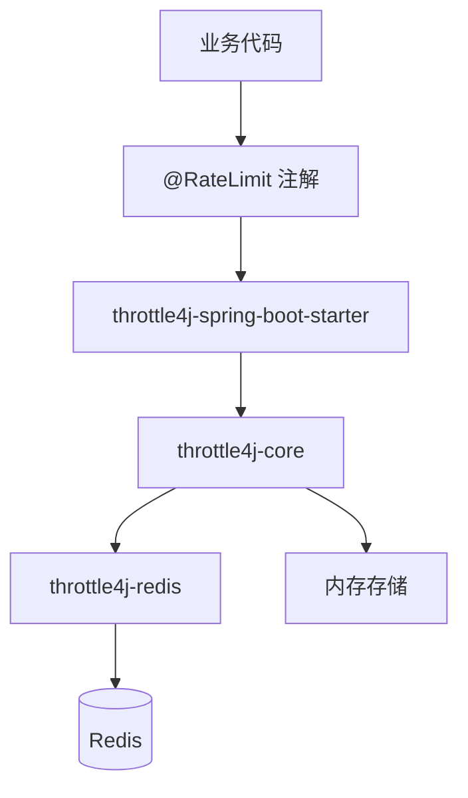

# throttle4j

[](https://github.com/hqbhonker/throttle4j/actions)
[](https://github.com/hqbhonker/throttle4j)
[](https://search.maven.org/artifact/com.throttle4j/throttle4j)
[](https://opensource.org/licenses/Apache-2.0)

一款轻量、高性能的 Java 分布式限流库。

[English](README.md) | [中文](README_CN.md)

---

## 特性

- **四种算法**：内置固定窗口、滑动窗口、令牌桶、漏桶。
- **存储可插拔**：单机使用内存存储，分布式使用 Redis 存储。
- **Spring Boot 零配置**：引入 starter 即开即用，无需手写配置。
- **声明式注解**：`@RateLimit` 注解直接挂在方法上，业务代码无侵入。
- **线程安全 / 无锁**：基于原子操作与 Redis Lua 脚本，高并发下保持一致性。
- **故障降级**：Redis 不可用时自动回退到本地存储，不影响主流程。
- **标准响应头**：自动写入 `X-RateLimit-Limit`、`X-RateLimit-Remaining`、`X-RateLimit-Reset`、`Retry-After`。

## 快速开始

### Maven

```xml
<dependency>
    <groupId>com.throttle4j</groupId>
    <artifactId>throttle4j-spring-boot-starter</artifactId>
    <version>0.1.0</version>
</dependency>
```

### Gradle

```groovy
implementation 'com.throttle4j:throttle4j-spring-boot-starter:0.1.0'
```

### 编程式使用

```java
RateLimiterConfig config = RateLimiterConfig.builder()
        .algorithm(Algorithm.TOKEN_BUCKET)
        .limit(100)
        .window(Duration.ofMinutes(1))
        .build();

RateLimiter limiter = RateLimiter.of("api:user:42", config);

if (limiter.tryAcquire()) {
    // 通过限流，继续处理
} else {
    // 被拒绝，可通过 limiter.getMetadata() 获取重试时间
}
```

### 声明式使用（Spring Boot）

```java
@RestController
public class OrderController {

    @RateLimit(key = "#userId", limit = 10, window = 60, algorithm = Algorithm.SLIDING_WINDOW)
    @GetMapping("/orders/{userId}")
    public List<Order> list(@PathVariable Long userId) {
        return orderService.findByUser(userId);
    }
}
```

超过阈值时，拦截器会返回 `HTTP 429 Too Many Requests`，并自动填充标准限流响应头。

## 架构



| 层 | 职责 |
| --- | --- |
| `throttle4j-core` | 算法、`RateLimiter` API、内存存储、配置模型 |
| `throttle4j-redis` | 基于 Lettuce + Lua 脚本的分布式存储 |
| `throttle4j-spring-boot-starter` | 自动配置、AOP 拦截器、Web 过滤器 |
| `throttle4j-examples` | 各算法与集成方式的可运行示例 |

## 算法对比

| 算法 | 适用场景 | 精确度 | 吞吐 | 内存占用 |
| --- | --- | --- | --- | --- |
| 固定窗口 (Fixed Window) | 简单计数、粗粒度配额 | 低（窗口边界毛刺） | 最高 | 最低 |
| 滑动窗口 (Sliding Window) | 平滑的 API 配额 | 高 | 高 | 中 |
| 令牌桶 (Token Bucket) | 允许突发、控制平均速率 | 高 | 高 | 低 |
| 漏桶 (Leaky Bucket) | 严格控制下游恒定速率 | 高 | 中 | 低 |

选型建议：
- **网关类 API 限流**：优先令牌桶。
- **要求窗口内绝对公平**：选滑动窗口。
- **保护下游不被冲垮**：选漏桶。
- **只是简单计数**：才考虑固定窗口。

## 配置参考

```yaml
throttle4j:
  enabled: true
  store: redis              # memory | redis
  default-algorithm: token_bucket
  fallback-on-error: true   # Redis 异常时自动降级到本地存储
  redis:
    host: 127.0.0.1
    port: 6379
    database: 0
    timeout: 200ms
  defaults:
    limit: 100
    window: 60s
```

所有配置项均可选，未配置时使用合理的默认值。

## 模块说明

| 模块 | 说明 |
| --- | --- |
| `throttle4j-core` | 核心算法、对外 API、内存存储，不依赖 Spring |
| `throttle4j-redis` | 基于 Lettuce 的分布式存储，使用原子 Lua 脚本 |
| `throttle4j-spring-boot-starter` | 自动配置、`@RateLimit` AOP、Web 拦截器、响应头处理 |
| `throttle4j-examples` | 覆盖所有算法的 Spring Boot 示例工程 |

## 从源码构建

```bash
git clone https://github.com/hqbhonker/throttle4j.git
cd throttle4j
mvn clean install
```

要求 JDK 11 及以上，CI 同时在 JDK 11 与 17 上跑测试。

## 参与贡献

欢迎 PR。请阅读 [CONTRIBUTING.md](CONTRIBUTING.md) 了解开发流程、代码风格与提交规范。

## 开源协议

基于 [Apache License 2.0](LICENSE) 协议开源。
